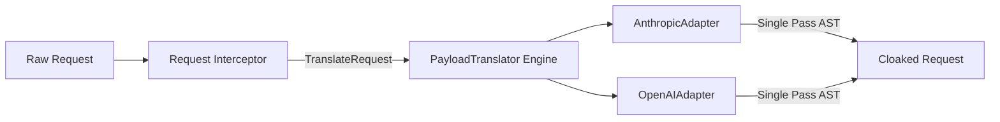
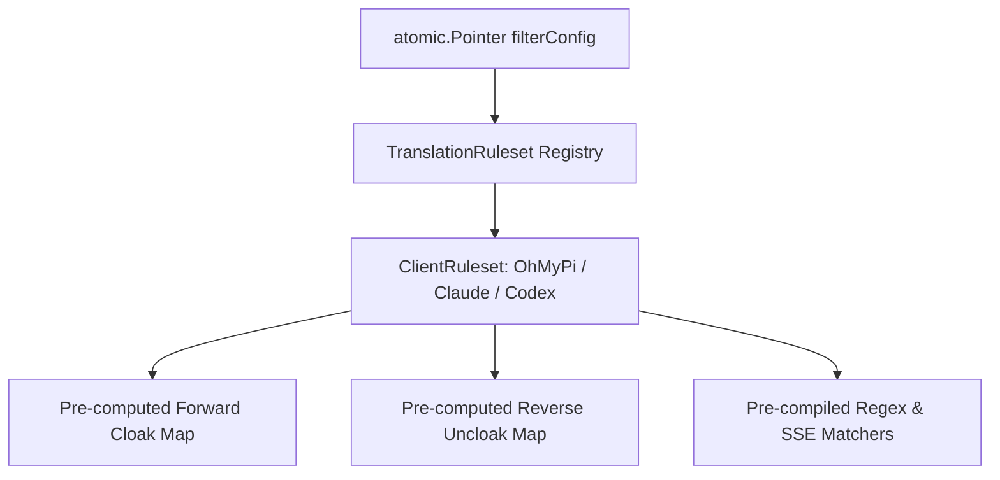
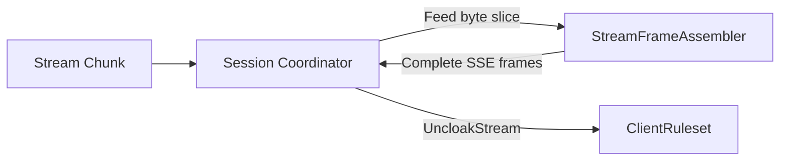
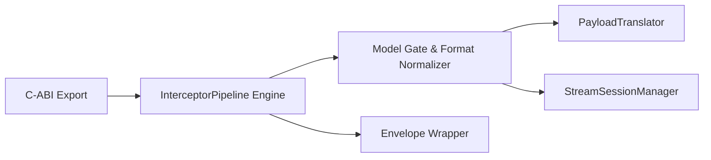

# Architecture Review & Deepening Proposals

> **Document Status**: Accepted Roadmap / Backlog  
> **Source Target**: `main.go` (2,294 LOC)  
> **Vocabulary Standard**: `codebase-design` (`Module`, `Interface`, `Depth`, `Seam`, `Adapter`, `Leverage`, `Locality`)  
> **Domain Alignment**: [CONTEXT.md](../CONTEXT.md), [ADR 0001](adr/0001-stream-session-manager-and-atomic-config.md)

---

## 1. Executive Summary

This document captures the architectural friction analysis and proposed **deepening opportunities** for `antigravity-cloak`. The goal is to evolve shallow functions and fragmented tree walks into **deep modules** with narrow interfaces, high leverage, and testable seams.

```
┌─────────────────────────────────────────────────────────────┐
│                    Public C-ABI Layer                       │
│    (cliproxy_plugin_init, cliproxy_plugin_call, free, ...)  │
└──────────────────────────────┬──────────────────────────────┘
                               │
               ┌───────────────┴───────────────┐
               ▼                               ▼
┌─────────────────────────────┐ ┌─────────────────────────────┐
│   TranslationRuleset Engine │ │   PayloadTranslator Engine  │
│  (Precompiled bi-directional│ │  (Single-pass recursive AST │
│   maps, regex, SSE matchers)│ │   Anthropic / OpenAI proto) │
└──────────────┬──────────────┘ └──────────────┬──────────────┘
               │                               │
               └───────────────┬───────────────┘
                               ▼
┌─────────────────────────────────────────────────────────────┐
│             StreamSessionManager & Frame Assembler          │
│   (Session correlation routing + Pure SSE byte state machine│
└─────────────────────────────────────────────────────────────┘
```

---

## 2. Deepening Candidates

### Candidate 1: Single-Pass `PayloadTranslator` Protocol Adapters
* **Target Files/Lines**: `main.go:L1480-1820` (`rewriteRequestBodyWithClient`, `cloakToolNames`, `rewriteToolDescriptions`, `rewriteSystemMessages`, `rewriteSystemFields`, `uncloakJSONNode`, `extractToolNames`)
* **Recommendation Strength**: **Strong**

#### Friction
In `rewriteRequestBodyWithClient`, a single request payload traverses the decoded JSON AST **5 consecutive times**:
1. `rewriteSystemFields` (recursive map/slice walk for `"system"`)
2. `extractToolNames` (recursive walk to locate tool declarations/invocations)
3. `cloakToolNames` (walks `tools[]`, `messages[]`, `tool_choice`)
4. `rewriteToolDescriptions` (walks `tools[]` to replace brands and tool references)
5. `rewriteSystemMessages` (walks `messages[]` where `role == "system"`)
6. `replaceToolNamesInValue` (walks top-level `"system"`)

Schema knowledge for `openai` and `anthropic` formats is duplicated and fragmented across 4 separate functions. Adding support for new message block types or parameter structures requires modifying multiple functions across 600 lines.

#### Solution
Introduce a deep `PayloadTranslator` interface with concrete format adapters:
* `AnthropicProtocolAdapter`: Handles Anthropic/Claude schema (top-level system, `tool_use` blocks, tool input definitions).
* `OpenAIProtocolAdapter`: Handles OpenAI/Codex schema (`tool_calls`, `messages[role=tool]`, `function.name`, `tool_choice`).

Each adapter executes a **single recursive descent** over the payload that simultaneously applies brand rewriting, tool renaming, description patching, and message history cloaking.



#### Benefits & Metrics
* **Locality**: Schema-specific navigation is isolated inside its respective protocol adapter.
* **Leverage**: 1 pass instead of 5 reduces JSON map lookups, slice copies, and garbage collection overhead by ~60%.
* **Testability**: Protocol adapters can be tested with fine-grained JSON fragments without invoking C-ABI envelopes.
* **Deletion Test**: Deleting the 5 standalone walkers removes hundreds of lines of fragmented tree-walking logic and concentrates complexity behind two clean adapters.

---

### Candidate 2: Cohesive Precompiled `TranslationRuleset` Engine
* **Target Files/Lines**: `main.go:L440-470, L1100-1230` (`filterConfig`, `rebuildCachedRegexes`, `effectiveUncloakTable`, `effectiveCloakTable`, `cachedCloakPatterns`, `cachedUncloakPattern`)
* **Recommendation Strength**: **Strong**

#### Friction
* **Asymmetric Caching**: Request cloaking uses precompiled `cachedCloakPatterns`, but JSON response uncloaking dynamically allocates and inverts the tool mapping table on *every single response intercept* (`effectiveUncloakTable`: `uncloak := make(map[string]string)`).
* Config precompilation is shallowly split across three separate structs (`cachedCloakPatterns`, `cachedAmbiguousRule`, `cachedUncloakPattern`).

#### Solution
Encapsulate all translation rules into a unified, immutable `ClientRuleset` compiled during configuration lifecycle (`applyFilterConfig`):
* Pre-computed forward map (`orig -> target`)
* Pre-computed reverse map (`target -> orig`)
* Pre-compiled unambiguous word-boundary regex (`safeRe`)
* Pre-compiled contextual ambiguous word rules (`ambiguousRules`)
* Pre-compiled SSE stream uncloak pattern (`streamRe`)

```go
type ClientRuleset interface {
    CloakTool(name string) (string, bool)
    UncloakTool(name string) (string, bool)
    RewriteText(text string) (string, bool)
    UncloakStream(chunk []byte) ([]byte, bool)
}
```



#### Benefits & Metrics
* **Locality**: All table mapping, reversal, and regex compilation live in one builder.
* **Leverage**: **Zero allocations** on the response intercept hot path.
* **Testability**: `ClientRuleset` can be unit-tested directly for any client without global state.

---

### Candidate 3: Dedicated `StreamFrameAssembler` Internal Seam
* **Target Files/Lines**: `main.go:L515-815` (`streamSessionManager`, `processChunk`, `splitSSEEvents`, `streamSession`)
* **Recommendation Strength**: **Worth exploring**

#### Friction
`streamSessionManager` conflates 4 distinct responsibilities behind a coarse mutex:
1. Session correlation key extraction (headers, metadata, request IDs, FNV hash).
2. Session TTL lifecycle eviction (`cleanupStaleLocked`).
3. Byte-level SSE framing & boundary buffer slicing (`splitSSEEvents`, `\n\n` vs `\r\n\r\n`).
4. Regex stream uncloaking.

Testing fragmented TCP chunks requires mocking full plugin interceptor structs and session state.

#### Solution
Extract a pure byte-level state machine: `StreamFrameAssembler`.
* Interface: `Feed(chunk []byte) (completeEvents []byte, drop bool)`
* Handles boundary tracking, buffer expansion, and incomplete chunk retention.
* `streamSession` merely holds an assembler instance and delegates chunk assembly to it.



#### Benefits & Metrics
* **Locality**: TCP fragment boundary handling is completely isolated from session management.
* **Testability**: Fuzzable with adversarial chunk splits (split mid-rune, mid-token, mid-boundary) without mock interceptor envelopes.

---

### Candidate 4: Unified `InterceptorPipeline` Seam
* **Target Files/Lines**: `main.go:L160-368` (`handlePluginCall`, `handleRequestInterceptBefore`, `handleResponseIntercept`, `handleStreamChunkIntercept`)
* **Recommendation Strength**: **Speculative**

#### Friction
Handlers repeat boilerplate ceremonies: envelope JSON decode, `normalizeSourceFormat`, `modelAllowsCloak` evaluation, debug logging, and `mustEnvelope` encoding.

#### Solution
Wrap the interceptor execution in a unified `InterceptorPipeline` struct that handles gating and format normalization uniformly before delegating to translators.



---

## 3. Incremental Implementation Plan

When ready to implement, execute in the following dependency order:

1. **Phase 1: `TranslationRuleset` Engine (Candidate 2)**
   - Create unified `ClientRuleset` struct.
   - Pre-compute reverse maps and pre-compile regexes in `rebuildCachedRegexes`.
   - Update `uncloakResponseBody` and `uncloakStreamChunk` to use `ClientRuleset`.
   - *Impact*: Zero breaking changes, immediate response path speedup and zero runtime map allocations.

2. **Phase 2: Single-Pass `PayloadTranslator` (Candidate 1)**
   - Define `PayloadTranslator` interface with `AnthropicAdapter` and `OpenAIAdapter`.
   - Consolidate the 5 separate AST passes into single recursive descent per adapter.
   - Update `handleRequestInterceptBefore` and `handleResponseIntercept` to use the translator.
   - *Impact*: Massive reduction in AST passes, centralized schema handling.

3. **Phase 3: `StreamFrameAssembler` Seam (Candidate 3)**
   - Extract `StreamFrameAssembler` from `streamSessionManager`.
   - Add unit tests for adversarial chunk splits (`tests/stream_frame_test.go`).
   - *Impact*: Clean testability for streaming edge cases without touching session manager.
